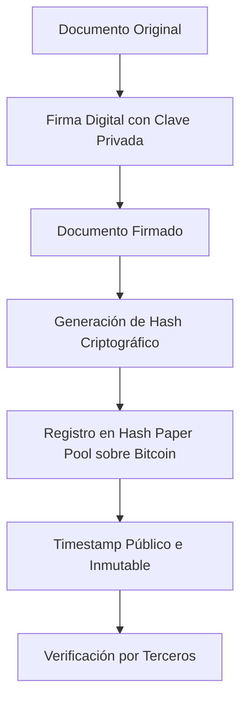

# Integración Avanzada de Firma Digital y Registro Criptográfico de Hash en la Red Bitcoin

**Autor:** Lerry Alexander Elizondo Villalobos (LAEV)  
**Proyecto:** Hash Paper Pool Service for Bitcoin Network  
**Fecha:** 10 de noviembre de 2025

---

## Introducción

En la era contemporánea de la digitalización global, la preservación de la seguridad, integridad y autenticidad de la información constituye un requisito esencial para la gestión de documentos legales, financieros, técnicos y académicos. La proliferación acelerada de documentos digitales y la necesidad de establecer evidencia verificable han impulsado el desarrollo de sistemas que integren la **autenticación del autor**, la **inmutabilidad criptográfica del contenido** y la **prueba temporal verificable** de existencia.

La combinación de la **firma digital basada en criptografía de clave pública** y el **registro de hash en la blockchain de Bitcoin**, implementada a través del **Hash Paper Pool Service**, constituye un marco metodológico integral. Este enfoque asegura no solo la autenticidad y la integridad, sino también un registro inmutable y públicamente verificable de cualquier documento digital, estableciendo estándares superiores de confiabilidad frente a manipulaciones, fraudes o disputas legales.

---

## Fundamentos Teóricos

### Firma Digital

La firma digital es un mecanismo criptográfico avanzado basado en infraestructura de clave pública (PKI). Permite al firmante generar una firma mediante su **clave privada** y a terceros verificarla mediante la **clave pública** correspondiente. Sus propiedades fundamentales incluyen:

- **Autenticidad:** Evidencia inequívoca de la identidad del autor, asegurando la procedencia del contenido.
- **Integridad:** Detección inmediata de cualquier alteración posterior al documento, garantizando que el contenido permanece inalterado desde su firma.
- **No repudio:** Previene que el autor niegue la autoría, consolidando la validez en contextos legales y contractuales.

En diversas jurisdicciones, la firma digital tiene equivalencia legal con la firma manuscrita y constituye evidencia válida en contratos, acuerdos notariales, certificaciones oficiales y otros documentos de relevancia jurídica.

### Registro Criptográfico de Hash

El registro de hash consiste en generar un **resumen criptográfico único** de un documento mediante algoritmos de alta seguridad, como SHA-256 o SHA-3, que luego se inserta en un medio público confiable, como la blockchain de Bitcoin. Sus principales ventajas incluyen:

- **Inmutabilidad:** Cualquier alteración, por mínima que sea, genera un hash diferente, asegurando la integridad del documento.
- **Prueba de existencia temporal:** El hash actúa como un timestamp verificable globalmente, proporcionando evidencia objetiva de la existencia del documento en un momento específico.
- **Confidencialidad:** El hash no revela información sobre el contenido, protegiendo la privacidad y seguridad del documento.

Aunque el hash garantiza integridad y registro temporal, **no autentica al autor**, por lo que su combinación con la firma digital es esencial para lograr un respaldo legal completo.

---

## Integración de Firma Digital y Registro de Hash

La integración de firma digital y hash combina seguridad criptográfica, autenticidad del firmante y verificación pública. El flujo metodológico recomendado comprende:

1. Redacción del documento conforme a estándares técnicos y legales.
2. Aplicación de la firma digital mediante la clave privada del autor, garantizando autenticidad y validez jurídica.
3. Generación del hash criptográfico del documento firmado, produciendo un identificador único y resistente a colisiones.
4. Registro del hash en Hash Paper Pool sobre la blockchain de Bitcoin, proporcionando un timestamp globalmente verificable.
5. Verificación por terceros mediante la comparación del hash recalculado con el registrado, confirmando integridad y existencia histórica.



Este flujo garantiza que cada documento cuente con **protección integral**, trazabilidad verificable y evidencia legal, sin depender de intermediarios centralizados.

---

## Ventajas de la Implementación Combinada

| Aspecto | Beneficio |
|---------|-----------|
| Autenticidad | Verificación inequívoca del autor mediante firma digital segura y criptográficamente sólida |
| Integridad | Detección inmediata y confiable de alteraciones o manipulaciones del contenido |
| Inmutabilidad | Garantía de que el documento y su hash permanecen inalterables en la blockchain de Bitcoin |
| Prueba de existencia | Evidencia temporal pública y verificable a nivel global |
| Respaldo legal | Cumplimiento con estándares internacionales de firma digital y regulación de documentos electrónicos |
| Transparencia | Posibilidad de verificación independiente y auditabilidad sin intermediarios |

---

## Aplicaciones Avanzadas

- **Contratos y acuerdos comerciales críticos:** Protección jurídica y evidencia de cumplimiento en transacciones estratégicas.
- **Documentos notariales y certificaciones oficiales:** Validación legal y autenticidad garantizada.
- **Certificaciones académicas y profesionales:** Prevención de falsificaciones y verificación confiable por terceros.
- **Propiedad intelectual y derechos de autor:** Registro de autoría y creación con evidencia inmutable y rastreable.
- **Documentos financieros y blockchain corporativa:** Auditoría confiable y trazabilidad integral en transacciones críticas.
- **Gestión de información estratégica corporativa:** Protección de activos documentales frente a alteraciones o pérdida.

---

## Scripts de Implementación Base

### 1. Firma Digital (`firmar_documento.py`)

```python
import os
from cryptography.hazmat.primitives import hashes, serialization
from cryptography.hazmat.primitives.asymmetric import padding, rsa
from cryptography.hazmat.backends import default_backend

DOCUMENTO = 'ejemplo_documento.md'
ARCHIVO_FIRMA = 'documento_firmado.sig'
CLAVE_PRIVADA_FILE = 'clave_privada.pem'
CLAVE_PUBLICA_FILE = 'clave_publica.pem'

def generar_claves():
    if not os.path.exists(CLAVE_PRIVADA_FILE):
        private_key = rsa.generate_private_key(public_exponent=65537, key_size=4096, backend=default_backend())
        public_key = private_key.public_key()
        with open(CLAVE_PRIVADA_FILE, 'wb') as f:
            f.write(private_key.private_bytes(encoding=serialization.Encoding.PEM, format=serialization.PrivateFormat.PKCS8, encryption_algorithm=serialization.NoEncryption()))
        with open(CLAVE_PUBLICA_FILE, 'wb') as f:
            f.write(public_key.public_bytes(encoding=serialization.Encoding.PEM, format=serialization.PublicFormat.SubjectPublicKeyInfo))

def firmar_documento():
    with open(CLAVE_PRIVADA_FILE, 'rb') as key_file:
        private_key = serialization.load_pem_private_key(key_file.read(), password=None, backend=default_backend())
    with open(DOCUMENTO, 'rb') as f:
        data = f.read()
    firma = private_key.sign(data, padding.PSS(mgf=padding.MGF1(hashes.SHA256()), salt_length=padding.PSS.MAX_LENGTH), hashes.SHA256())
    with open(ARCHIVO_FIRMA, 'wb') as f:
        f.write(firma)

if __name__ == '__main__':
    generar_claves()
    firmar_documento()
```

### 2. Generación de Hash (`registrar_hash.py`)

```python
import hashlib

DOCUMENTO_FIRMADO = 'documento_firmado.sig'
HASH_FILE = 'hash_documento.txt'

def generar_hash():
    with open(DOCUMENTO_FIRMADO, 'rb') as f:
        data = f.read()
    hash_obj = hashlib.sha256(data)
    hash_hex = hash_obj.hexdigest()
    with open(HASH_FILE, 'w') as f:
        f.write(hash_hex)
    print(f'Hash generado: {hash_hex}')

if __name__ == '__main__':
    generar_hash()
```

Estos scripts constituyen un marco metodológico sólido y extensible, adaptable a diversos contextos legales y tecnológicos.

---

## Conclusión

La convergencia de firma digital y registro criptográfico de hash en la blockchain de Bitcoin a través de Hash Paper Pool constituye una solución de vanguardia, ofreciendo seguridad criptográfica, validez legal, escalabilidad y trazabilidad integral. Este enfoque asegura **autenticidad del autor, integridad del contenido, prueba de existencia inmutable y respaldo jurídico sólido**, estableciendo un estándar de excelencia en la protección de información crítica en entornos digitales y legales avanzados.

---

## Estructura Recomendada del Repositorio

```
/tu-repositorio
│
├─ README.md                   # Documento académico completo y detallado
├─ ejemplo_documento.md         # Documento de prueba para implementación
├─ flujo_firma_hash.svg         # Representación visual del flujo metodológico
└─ scripts/                     # Scripts base de implementación
    ├─ firmar_documento.py
    └─ registrar_hash.py
```

Esta estructura garantiza organización óptima, claridad conceptual y replicabilidad, facilitando la implementación por desarrolladores y profesionales especializados en seguridad de la información y blockchain.

